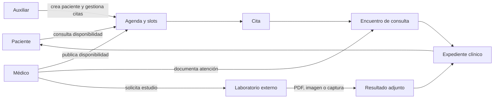

# Requisitos iniciales del consultorio

## 1. Alcance

El primer despliegue de XII se utilizará para un consultorio de medicina
general. CARE se usará principalmente para agenda de citas y expediente
clínico, con solicitudes y resultados de laboratorio externo.

El consultorio tiene tres espacios físicos, de los cuales actualmente se usan
dos porque hay dos médicos activos.

## 2. Tipos de cita

- Primera consulta.
- Consulta de seguimiento.
- Atención urgente.
- Videoconsulta.

La disponibilidad dependerá de los horarios y slots configurados para cada
médico.

## 3. Actores

### Auxiliar

El auxiliar combina recepción y apoyo administrativo. No existe una recepción
separada.

Necesita poder:

- crear pacientes;
- consultar datos personales;
- consultar el motivo de consulta;
- consultar el expediente clínico;
- crear, modificar y cancelar citas;
- trabajar con slots disponibles.

El permiso para modificar contenido clínico todavía debe decidirse. Como regla
inicial, el auxiliar puede consultar el expediente, pero no debe modificar
diagnósticos, tratamientos, recetas ni notas clínicas salvo que el consultorio
lo confirme expresamente.

### Médico

El médico puede realizar todo lo que aplique a la atención de medicina general:

- gestionar su disponibilidad y citas según la política definida;
- abrir y completar encuentros;
- consultar el expediente histórico;
- registrar notas clínicas;
- registrar diagnósticos;
- indicar tratamientos;
- emitir recetas;
- solicitar estudios de laboratorio;
- adjuntar o capturar resultados;
- registrar seguimiento;
- atender videoconsultas cuando exista el soporte operativo correspondiente.

### Paciente

Se desea habilitar un portal del paciente para:

- consultar disponibilidad;
- solicitar o reservar citas dentro de los slots permitidos;
- consultar sus propias citas;
- cancelar o solicitar cambios según la política del consultorio;
- consultar su expediente y resultados autorizados;
- cargar o consultar documentos cuando corresponda.

El paciente nunca debe acceder a datos de otros pacientes ni a notas internas no
destinadas al portal.

## 4. Laboratorio externo

El consultorio no necesita operar un laboratorio propio.

Flujo inicial:

1. El médico crea una orden o solicitud de estudio.
2. El paciente realiza el estudio con un proveedor externo.
3. El resultado se recibe como PDF, imagen o captura manual.
4. El resultado se asocia al paciente y a la consulta correspondiente.
5. Una integración automática podrá añadirse posteriormente.

No se requiere inicialmente configurar equipos, muestras, ubicaciones de
laboratorio, inventario de laboratorio ni procesamiento interno.

## 5. Facturación y pagos

El consultorio sí necesita manejar pagos o facturación dentro de CARE.

Queda pendiente definir:

- si se factura la cita, el servicio o ambos;
- quién registra el pago;
- si se manejan anticipos, reembolsos o saldos pendientes;
- si el paciente puede ver recibos;
- si se necesita integrar un proveedor de pagos.

## 6. Capacidad inicial de la institución

La configuración inicial debe representar:

- una facility del consultorio;
- tres espacios físicos, con dos activos en uso;
- dos médicos activos;
- auxiliares asociados al consultorio;
- servicios de medicina general;
- horarios y slots por médico;
- los cuatro tipos de cita definidos.

No se habilitarán inicialmente módulos hospitalarios que no correspondan:

- hospitalización y camas;
- urgencias hospitalarias;
- farmacia interna;
- inventario clínico;
- laboratorio interno;
- dispositivos médicos;
- suministros hospitalarios.

La categoría “atención urgente” se tratará inicialmente como tipo de cita del
consultorio, no como un servicio de urgencias hospitalarias.

## 7. Flujo principal aprobado

## 8. Decisiones todavía pendientes

- Si los médicos pueden modificar cualquier cita o sólo las propias.
- Si los auxiliares pueden modificar notas clínicas o sólo consultarlas.
- Qué campos del expediente son obligatorios.
- Qué tipos de receta se necesitan.
- Qué información del expediente se publica al portal del paciente.
- Si el paciente puede cancelar directamente o sólo solicitar cancelación.
- Cómo se cobran primera consulta, seguimiento, urgencia y videoconsulta.
- Cómo se registran pagos, saldos, reembolsos y recibos.
- Qué proveedor externo de laboratorio se utilizará.
- Qué integración automática se priorizará después del flujo manual.

## 9. Siguiente paso

Diseñar la estructura mínima de la facility y el modelo de perfiles:

- nombres de la facility y del área interna;
- asociación de los tres espacios;
- asociación de los dos médicos;
- definición inicial de Auxiliar, Médico y Paciente;
- separación entre permisos de agenda, expediente y facturación.

No se debe empezar asignando `Staff` o `Facility Admin` sin comparar sus
permisos actuales con este alcance.
