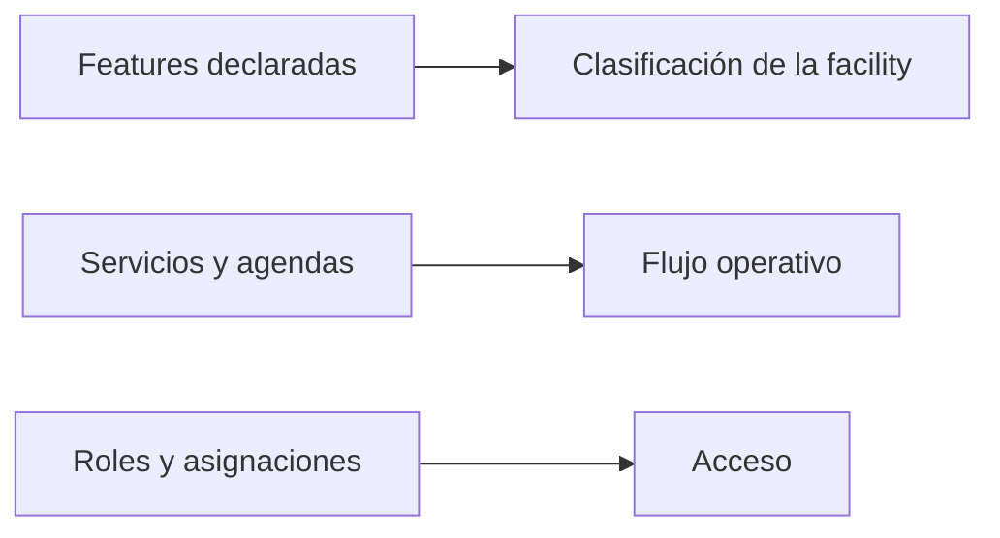

# Contrato de funcionalidades de una facility

## Propósito

`Facility.features` describe capacidades declaradas de una facility. No crea
servicios, agendas, permisos ni módulos automáticamente.

## Lista homologada

El backend y el frontend usan los mismos IDs y nombres:

| ID | Feature |
| --- | --- |
| 1 | CT Scan |
| 2 | Maternity Care |
| 3 | X-Ray |
| 4 | Neonatal Care |
| 5 | Operation Theater |
| 6 | Blood Bank |
| 7 | Emergency Services |
| 8 | Inpatient Services |
| 9 | Outpatient Services |
| 10 | Intensive Care Units (ICU) |
| 11 | Pharmacy |
| 12 | Rehabilitation Services |
| 13 | Home Care Services |
| 14 | Psychosocial Support |
| 15 | Respite Care |
| 16 | Daycare Programs |

## Garantía de backend

La API valida que cada identificador enviado en `features` pertenezca a esta
lista y rechaza los demás. La prueba de API crea una facility con los 16 IDs y
comprueba que un ID desconocido se rechaza.

## Configuración inicial del consultorio XII

No se selecciona ninguna feature inicialmente. La atención ambulatoria se
configurará con servicios, agendas y slots. Cuando se decida declarar esa
capacidad, puede marcarse `Outpatient Services` (ID 9).
