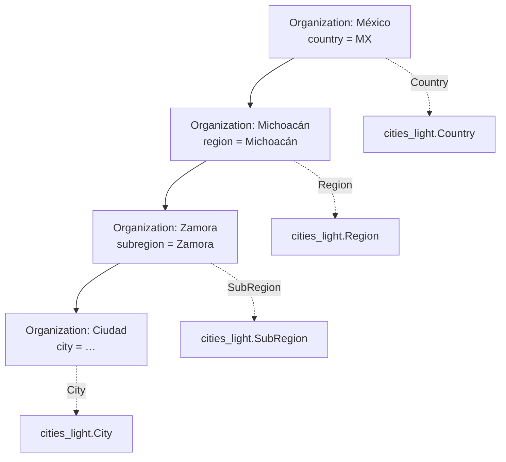

# Catálogo geográfico, jurisdicciones y códigos postales

## Decisión

CARE separa dos conceptos que antes se mezclaban bajo el nombre `state`:

1. **Organización gubernamental (`Organization`, tipo `govt`)**: ámbito de
   operación, administración y permisos de CARE.
2. **Catálogo geográfico (`django-cities-light`)**: país, región, subregión y
   ciudad importados desde GeoNames.

Una organización sólo guarda el nodo geográfico que le corresponde
directamente. Sus antecesores se derivan del catálogo; no se copian.



No se crean organizaciones para todas las localidades del catálogo. Sólo se
crean donde CARE necesita jerarquía operativa, usuarios, instalaciones,
permisos o reportes. Así la organización sigue sirviendo como ámbito de acceso
y no como una réplica innecesaria del catálogo mundial.

## Reglas aplicadas

- Una organización `govt` puede apuntar a **un único nodo directo**.
- Una raíz geográfica corresponde a un país.
- La cadena permitida es país → región → subregión → ciudad.
- Una hija debe apuntar a un nodo cuyo padre de catálogo sea el nodo de su
  organización padre.
- No se puede cambiar el nodo de una organización geográfica que ya tenga
  hijas.
- Una instalación conserva su **jurisdicción administrativa** (`geo_organization`)
  y puede tener ubicación física: `region`, `subregion` y `city`. El país se
  deriva de la jurisdicción, nunca se vuelve a capturar.

## Código postal

`pincode` se cambia de número a texto para conservar ceros iniciales y admitir
formatos internacionales. La validación existe tanto en backend como en
frontend y toma el país derivado de la organización geográfica.

| País | Etiqueta | Formato |
|---|---|---|
| México (`MX`) | Código postal | 5 dígitos |
| Estados Unidos (`US`) | ZIP code | `12345` o `12345-6789` |
| India (`IN`) | PIN code | 6 dígitos |
| Otros | Postal code | 2–12 caracteres alfanuméricos, espacios o guiones |

Esta misma validación cubre instalaciones, pacientes y el flujo público de
registro de pacientes.

## Registro de pacientes desde una facility

El país del domicilio del paciente **no se captura ni se puede cambiar** al
registrarlo desde una facility. El backend lo deriva de
`facility.geo_organization`; por ejemplo, un alta en **IMSS Malestar** bajo la
organización México queda en México aunque un navegador intente enviar otra
organización geográfica.

- `region`, `subregion` y `city` guardan el detalle del domicilio y se validan
  contra ese país, en la cadena región → subregión → ciudad.
- El teléfono inicia con el código del país de la facility (por ejemplo `+52`),
  pero su selector permanece disponible: un paciente puede tener un teléfono
  extranjero.
- El alta interna envía `registration_facility`; el flujo público lo exige y
  acepta únicamente facilities públicas. Esto permite que la validación sea
  también una regla de servidor y no sólo de interfaz.

## Despliegue inicial

1. Resolver e instalar `django-cities-light==3.11` desde el `Pipfile` y
   actualizar el lockfile cuando haya conectividad.
2. Ejecutar migraciones.
3. Importar el catálogo para los países habilitados:

   ```sh
   python manage.py cities_light --keep-slugs
   ```

   La variable `CITIES_LIGHT_INCLUDE_COUNTRIES` inicia con `MX`; se puede
   ampliar antes de importar nuevos países.
4. Editar cada organización geográfica raíz existente y enlazarla con su país
   del catálogo. Después enlazar cada hija, de arriba hacia abajo.
5. Editar las instalaciones existentes y completar su ubicación física.

No se debe desplegar el frontend antes de que el backend, las migraciones y al
menos el catálogo de México estén listos: los selectores necesitan esos datos.

## Archivos principales

- Backend: `care/emr/models/organization.py`,
  `care/facility/models/facility.py`, `care/emr/geography/`.
- API del catálogo: `GET /api/v1/geography/?level=country|region|subregion|city&parent=<id>`.
- Frontend: `src/components/Geography/`,
  `src/components/Facility/FacilityForm.tsx`.
