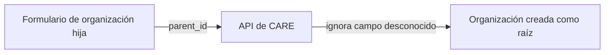
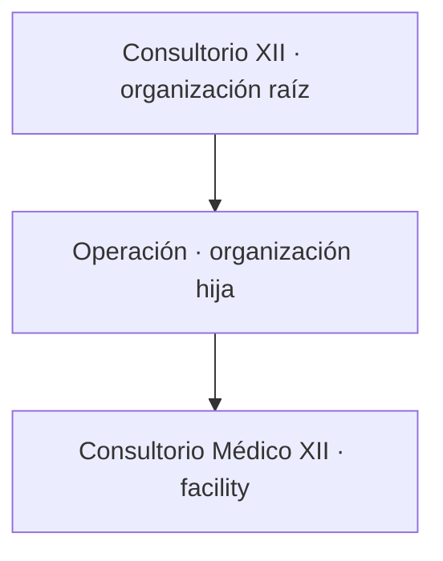

# Creación de organizaciones jerárquicas

## Hallazgo

Al crear una organización hija desde **Admin → Organizations → Governance**, la
interfaz mostraba el contexto de la organización padre, pero enviaba el campo
JSON `parent_id`.

El contrato del backend usa `parent`. Como `parent_id` no forma parte del
esquema de creación, se ignora sin error y la nueva organización se crea como
raíz. La respuesta HTTP es `200`, por lo que el problema no era visible sin
inspeccionar la petición.



## Contrato correcto

```json
{
  "name": "Operación",
  "org_type": "govt",
  "parent": "<external_id de la organización padre>"
}
```

## Corrección aplicada en frontend

La creación envía `parent`. Las actualizaciones no incluyen el padre, pues el
backend actual no soporta reubicar una organización existente mediante el
endpoint de actualización.



## Consecuencia operativa

Las organizaciones creadas erróneamente como raíz no pueden convertirse en
hijas desde la interfaz actual. Tras desplegar la corrección, deben eliminarse
si no tienen dependencias y crearse de nuevo bajo el padre correcto.

## Backend

No requiere modificación funcional: `OrganizationWriteSpec` ya define
`parent` como el identificador de la organización padre. Este documento se
conserva en el repositorio backend porque describe el contrato de la API y su
comportamiento ante campos no reconocidos.
