# Mapa de accesos por perfil

Este diagrama resume los dominios funcionales habilitados por los roles del
sistema. No sustituye la autorización por recurso: el acceso efectivo depende
también de la institución, organización, departamento, paciente o encuentro al
que el usuario esté asociado.

```mermaid
flowchart LR
    SUPER["admin / admin\nSuperusuario"]
    VOL["care-volunteer\nVolunteer"]
    STF["care-staff\nStaff"]
    DOC["care-doctor\nDoctor"]
    NUR["care-nurse\nNurse"]
    FADM["care-fac-admin\nFacility Admin"]

    PAT["Pacientes y formularios"]
    CLIN["Encuentros y datos clínicos"]
    SCH["Horarios, citas y tokens"]
    FAC["Institución, ubicaciones y dispositivos"]
    ORG["Organizaciones y usuarios"]
    BILL["Cuentas, cargos, facturas y pagos"]
    MED["Medicamentos y laboratorio"]
    SUP["Inventario y suministros"]
    QST["Cuestionarios y plantillas"]
    REPORT["Reportes"]
    ADMIN["Configuración y administración"]

    SUPER --> PAT
    SUPER --> CLIN
    SUPER --> SCH
    SUPER --> FAC
    SUPER --> ORG
    SUPER --> BILL
    SUPER --> MED
    SUPER --> SUP
    SUPER --> QST
    SUPER --> REPORT
    SUPER --> ADMIN

    VOL -->|"listar pacientes; cuestionarios; lectura operativa"| PAT
    VOL -->|"no tiene acceso normal a encuentros"| CLIN
    VOL -->|"sin agenda clínica operativa"| SCH
    VOL -->|"lectura limitada"| FAC
    VOL -->|"consulta organizaciones y usuarios"| ORG
    VOL -->|"lectura declarada; revisar necesidad"| BILL
    VOL -->|"lectura declarada; revisar necesidad"| MED
    VOL -->|"lectura y envío"| QST
    VOL -->|"lectura declarada"| SUP
    VOL -->|"lectura y generación desde plantillas"| REPORT

    STF -->|"crear, leer y actualizar; datos clínicos"| PAT
    STF -->|"sin CRUD normal de encuentros"| CLIN
    STF -->|"crear horarios; citas; reprogramar; tokens"| SCH
    STF -->|"actualizar institución; ubicaciones; dispositivos"| FAC
    STF -->|"listar usuarios; no asignar roles"| ORG
    STF -->|"leer y modificar facturas y pagos"| BILL
    STF -->|"dispensación; reportes y especímenes"| MED
    STF -->|"leer y solicitar suministros"| SUP
    STF -->|"leer, enviar y modificar plantillas de respuesta"| QST
    STF -->|"leer y generar"| REPORT

    DOC -->|"crear, leer y actualizar"| PAT
    DOC -->|"crear, leer y actualizar encuentros clínicos"| CLIN
    DOC -->|"agenda y reservas"| SCH
    DOC -->|"lectura institucional"| FAC
    DOC -->|"listar usuarios; no administrar roles"| ORG
    DOC -->|"lectura y algunas escrituras clínicas/financieras"| BILL
    DOC -->|"lectura y escritura clínica relacionada"| MED
    DOC -->|"lectura operativa"| SUP
    DOC -->|"cuestionarios y plantillas"| QST
    DOC -->|"reportes"| REPORT

    NUR -->|"crear, leer y actualizar"| PAT
    NUR -->|"crear, leer y actualizar encuentros clínicos"| CLIN
    NUR -->|"agenda y reservas"| SCH
    NUR -->|"lectura institucional"| FAC
    NUR -->|"listar usuarios; no administrar roles"| ORG
    NUR -->|"lectura y algunas escrituras clínicas/financieras"| BILL
    NUR -->|"lectura y escritura clínica relacionada"| MED
    NUR -->|"lectura operativa"| SUP
    NUR -->|"cuestionarios y plantillas"| QST
    NUR -->|"reportes"| REPORT

    FADM -->|"gestión completa"| PAT
    FADM -->|"gestión completa"| CLIN
    FADM -->|"horarios, citas y tokens"| SCH
    FADM -->|"configuración de la institución"| FAC
    FADM -->|"crear usuarios y administrar asociaciones"| ORG
    FADM -->|"gestión financiera institucional"| BILL
    FADM -->|"medicamentos y laboratorio"| MED
    FADM -->|"inventario y suministros"| SUP
    FADM -->|"gestión de cuestionarios y plantillas"| QST
    FADM -->|"reportes"| REPORT
    FADM -->|"configuración operativa"| ADMIN

    classDef super fill:#7f1d1d,color:#fff,stroke:#450a0a;
    classDef role fill:#0f766e,color:#fff,stroke:#134e4a;
    classDef domain fill:#f3f4f6,color:#111827,stroke:#9ca3af;
    class SUPER super;
    class VOL,STF,DOC,NUR,FADM role;
    class PAT,CLIN,SCH,FAC,ORG,BILL,MED,SUP,QST,REPORT,ADMIN domain;
```

## Lectura rápida

| Perfil | Resumen |
| --- | --- |
| Volunteer | Lectura y formularios; sin administración clínica ni de usuarios |
| Staff | Operación institucional amplia; pacientes, agenda, facturación y logística |
| Doctor | Atención clínica y encuentros; permisos administrativos limitados |
| Nurse | Atención clínica y encuentros; permisos declarados iguales a Doctor |
| Facility Admin | Administración completa de una institución concreta |
| Superusuario | Acceso global fuera de las restricciones normales de roles |

## Advertencias

- El diagrama representa permisos declarados, no necesariamente módulos visibles
  en cada pantalla.
- Un rol sin asociación al recurso no puede usar el permiso sobre ese recurso.
- Staff, Doctor y Nurse no forman una jerarquía perfecta; sus conjuntos se
  solapan de forma diferente.
- `Developer Mode` no es un permiso de usuario: debe controlarse mediante una
  bandera global del build del frontend.
- La revisión visual de Staff, Doctor, Nurse y Facility Admin todavía está
  pendiente.
